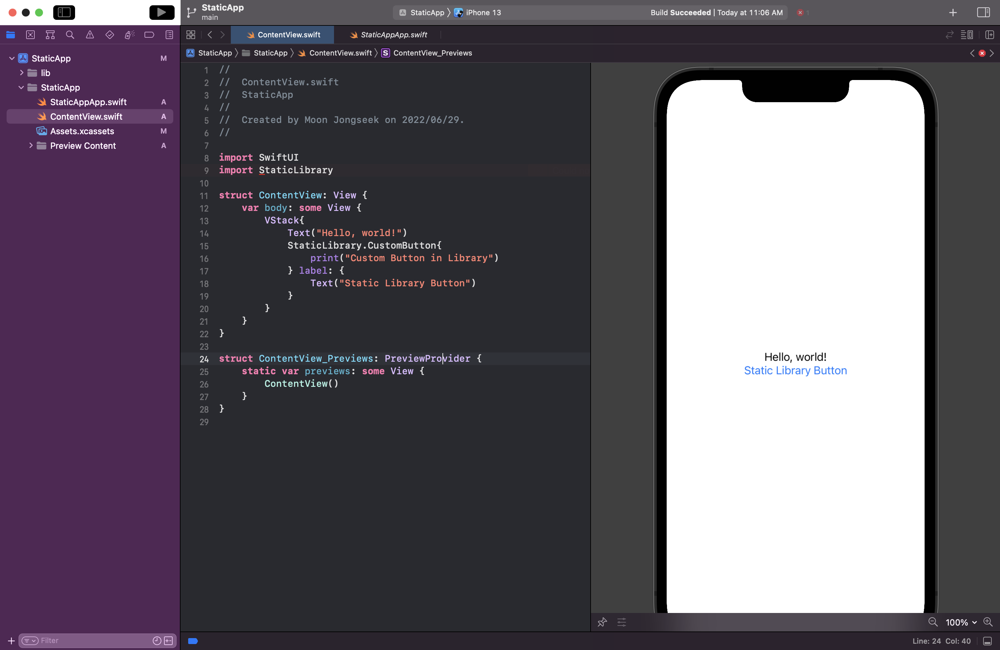

# iOS-Static-Library-Example

[![Swift Version][swift-image]](https://swift.org/)
[![Xcode Version][Xcode-image]](https://developer.apple.com/kr/xcode/)
[![Platform][Platform-image]](https://developer.apple.com/kr/ios/)

[swift-image]:https://img.shields.io/badge/Swift-5.6-orange?style=flat
[Xcode-image]: https://img.shields.io/badge/Xcode-13.3-blue?style=flat
[Platform-image]: https://img.shields.io/badge/iOS-15.4+-blue?style=flat

iOS Static Library를 직접 만들어보고 적용해보는 프로젝트입니다.

Custom Button을 Static Library로 만들어보며 학습합니다.

## Repository Structure
``` shell
iOS-Static-Library-Example
├── Library       // Static Library
├── StaticApp     // App Project
└── StaticLibrary // Static Library Project
```

## 1. Create Project
### App Project


- Optional
    - Use Core Data
    - Include Tests

### Library Project


## 2. App Project Setting
### Create Library Folder
xcodeproj 파일이 있는 곳에 lib 폴더를 생성


App -> Targets-App -> Build Settings -> Select All, Combined


> Search Paths -> Library Search Paths
> 
> `$(inherited) $(PROJECT_DIR) $(PROJECT_DIR)/lib` 추가

<br>

> Swift Compiler - Search Paths -> Import Paths
> 
> `$(inherited) $(PROJECT_DIR) $(PROJECT_DIR)/lib` 추가

## 3. Coding Custom Button in Library Project
``` swift
// CustomButton.swift
import SwiftUI

public struct CustomButton<L> : View where L : View {
    let role: ButtonRole?
    let action: () -> Void
    let label: () -> L

    public init(role: ButtonRole? = .none, action: @escaping () -> Void, @ViewBuilder label: @escaping () -> L) {
        self.role = role
        self.action = action
        self.label = label
    }
    
    public var body: some View {
        Button(role: self.role) {
            self.action()
        } label: {
            self.label()
        }
    }
}
```

## 4. Build Simulator & Device
iOS 기기 시뮬레이터 선택 후 빌드(Command + B)


Any iOS Device 또는 실제 Device 선택 후 빌드(Command + B)


## 5. Find Build File
Product -> Show Build Folder in Finder


Binary File(.a file)과 Swift Module이 생성됐는지 확인한다.


> App Scheme에 따라 Build Folder명이 Debug 또는 Release로 시작된다.
> 

## 6. Copy Library File
테스트할 환경에 맞춰 lib 폴더에 라이브러리 복사


## 7. Import Library

lib 폴더를 project에 추가
|  |  |
|-|-|

## 7. Use Library
``` swift
import SwiftUI
import StaticLibrary

struct ContentView: View {
    var body: some View {
        VStack{
            Text("Hello, world!")
            CustomButton{
                print("Custom Button in Library")
            } label: {
                Text("Static Library Button")
            }
        }
    }
}
```

## 8. App Build
Build or Run으로 확인한다.


## 9. Error
Library를 M1 CPU에서 만들었기 때문에 x86_64(Intel CPU)에서 빌드될 Simulator에 대한 정보가 없다는 오류

-> 실행가능한 오류


## 10. Improvement
- Simulator와 Device 동시에 사용가능한 Binary 파일을 만드는 것

[Next Try](README-Scheme.md)