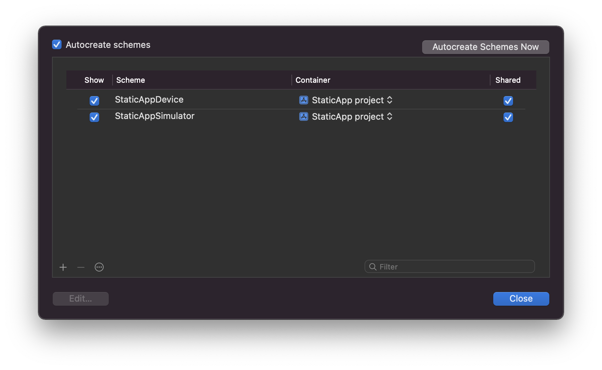
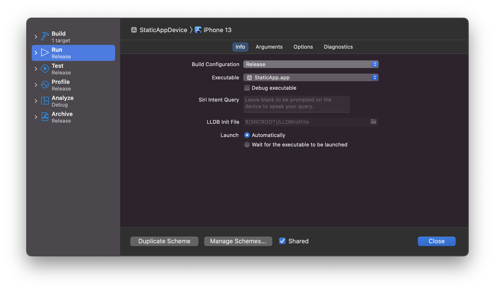
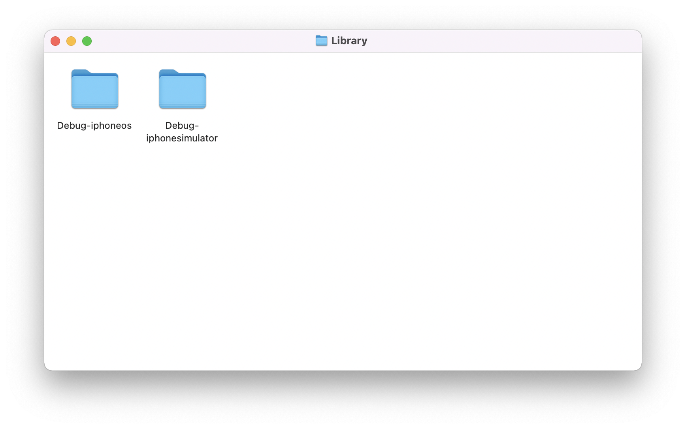
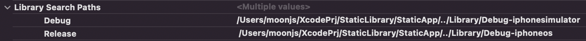
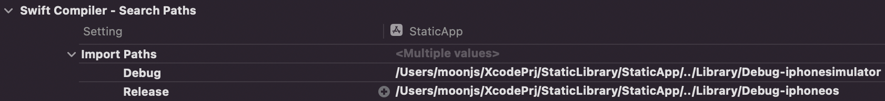
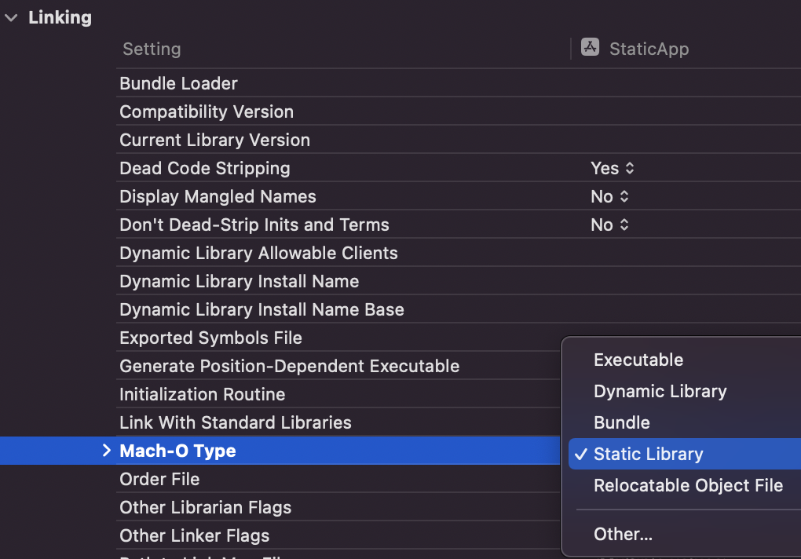
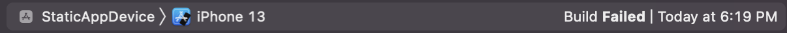
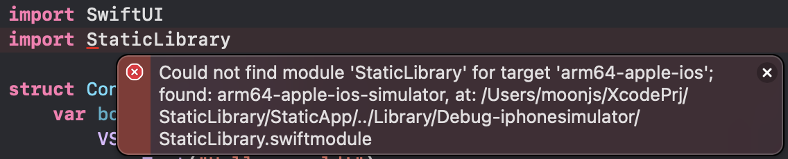

# iOS-Static-Library-Example

[![Swift Version][swift-image]](https://swift.org/)
[![Xcode Version][Xcode-image]](https://developer.apple.com/kr/xcode/)
[![Platform][Platform-image]](https://developer.apple.com/kr/ios/)

[swift-image]:https://img.shields.io/badge/Swift-5.6-orange?style=flat
[Xcode-image]: https://img.shields.io/badge/Xcode-13.3-blue?style=flat
[Platform-image]: https://img.shields.io/badge/iOS-15.4+-blue?style=flat

iOS Static Library를 직접 만들어보고 적용해보는 프로젝트입니다.

Custom Button을 Static Library로 만들어보며 학습합니다.

## 이전 시도
[Static Library](README-Library.md)

## Repository Structure
``` shell
iOS-Static-Library-Example
├── Library       // Static Library
├── StaticApp     // App Project
└── StaticLibrary // Static Library Project
```

---
## 0. Introduction
이전 시도에서는 빌드 타겟이 바뀔 때마다 파일을 교체해줘야하는 상황이었다.   
그래서 이번에는 Scheme를 이용해보았다.

## 1. Add Scheme


Simulator와 Device에서 실행할 Scheme를 생성한다.

## 2. Build Configuration

Edit Scheme를 통해 각 Scheme의 Build Configuration를 설정해준다.
여기서 Device용 Scheme는 Release로, Simulator용 Scheme는 Debug로 설정했다.

## 3. Copy Library
Library파일들을 프로젝트 내 폴더에 복사해둔다.

(이 예제에서는 Library 폴더를 생성하여 복사하였음.)




## 4. Library Search Path

`App` -> `Targets-App` -> `Build Settings` -> `Select All`, `Combined`에서

아래 두 가지 Path를

> `Search Paths` -> `Library Search Paths`

> `Swift Compiler` -> `Search Paths` -> `Import Paths`

Debug와 Release에 따라 다르게 설정해준다.





Path는 방금 복사한 Library의 경로가 되어야합니다.

## 5. Linking
마찬가지로 `App` -> `Targets-App` -> `Build Settings` -> `Select All`, `Combined`에서

`Mach-O Type`의 Value를 Static Library로 설정한다.



## 6. Build
빌드가 되는지 확인한다.


만약 Scheme와 Build Target Device가 맞지 않는다면,

빌드가 실패한다.

## 7. Conclusion
드디어 브랜치를 나누지 않아도, 하나의 프로젝트에서 실행이 가능하도록 Library를 나눴다!

한가지 걸리는 것은 Library 코드의 자동완성이 안되고, Import 부분에서 계속 Architecture 관련 에러가 표시된다.


그래서 다음엔 Framework를 사용해보려고한다.
[Next Try](README.md)