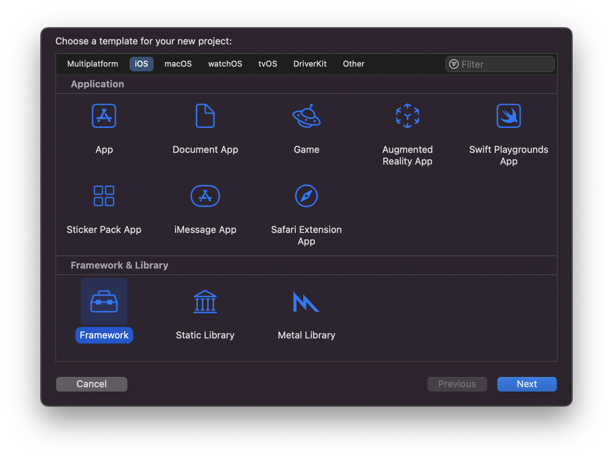
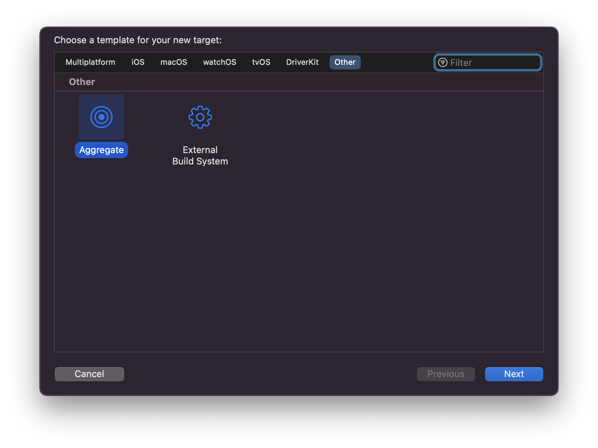
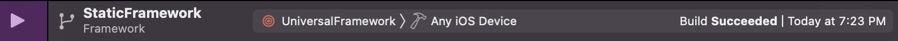
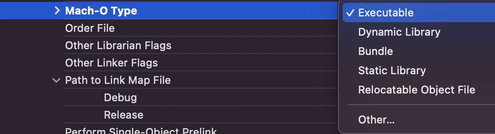
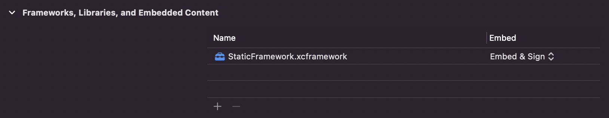

# iOS-Static-Library-Example

[![Swift Version][swift-image]](https://swift.org/)
[![Xcode Version][Xcode-image]](https://developer.apple.com/kr/xcode/)
[![Platform][Platform-image]](https://developer.apple.com/kr/ios/)

[swift-image]:https://img.shields.io/badge/Swift-5.6-orange?style=flat
[Xcode-image]: https://img.shields.io/badge/Xcode-13.3-blue?style=flat
[Platform-image]: https://img.shields.io/badge/iOS-15.4+-blue?style=flat

iOS Static Library/Framework를 직접 만들어보고 적용해보는 프로젝트입니다.

Custom Button을 Static Library/Framework로 만들어보며 학습합니다.

## 이전 시도들
[Static Library](README-Library.md)
[Divide Scheme](README-Scheme.md)

## Repository Structure
``` shell
iOS-Static-Library-Example
├── Library       // Static Library
├── StaticApp     // App Project
└── StaticLibrary // Static Library Project
```

---
## 0. Introduction
이전 시도에서는 빌드 타겟이 바뀔 때마다 파일을 교체해줘야하는 상황이었다.   
그래서 이번에는 Scheme를 이용해보았다.

## 1. Create Framework Project

Framework를 선택해서 새로운 프로젝트를 만든다.

## 2. Coding
아래 세 개의 코드를 테스트 해보려고 한다.

``` swift
// CustomButton.swift
public struct CustomButton<L> : View where L : View {
    let role: ButtonRole?
    let action: () -> Void
    let label: () -> L

    public init(role: ButtonRole? = .none, action: @escaping () -> Void, @ViewBuilder label: @escaping () -> L) {
        self.role = role
        self.action = action
        self.label = label
    }
    
    public var body: some View {
        Button(role: self.role) {
            self.action()
        } label: {
            self.label()
        }
    }
}
```

``` swift
// StaticNum.swift
public enum StaticNum: Int {
    case one, two, three
    
    public var num: Int {
        switch self {
        case .one:
            return 1
        case .two:
            return 2
        case .three:
            return 3
        }
    }
}
```

``` swift
// StaticFunc.swift
public func staticPrint<T: StringProtocol>(_ text: T) {
    print(text)
}
```

## 3. Add New Aggregate Target
초기에 Static Library를 진행했을 때와 상황이 동일했다.

파일을 따로 나눴어야 했고, `lipo` 명령어로 합쳐지지도 않았다.

그래서 결국 선택한 것이 [XCFramework](https://help.apple.com/xcode/mac/11.4/#/dev6f6ac218b)이다.

XCFramework를 만들어보자.

Framework 프로젝트에 Aggregate Target을 추가한다.


## 4. Add Run Script

Aggregate의 `Build Phases` -> `New Run Script Phase` 를 통해 Script를 추가한다.
``` bash
# Build Device and Simulator versions
xcodebuild archive -scheme "${PROJECT_NAME}" -archivePath "${BUILD_DIR}/iphoneos.xcarchive" -sdk iphoneos SKIP_INSTALL=NO BUILD_LIBRARY_FOR_DISTRIBUTION=YES
xcodebuild archive -scheme "${PROJECT_NAME}" -archivePath "${BUILD_DIR}/iphonesimulator.xcarchive" -sdk iphonesimulator SKIP_INSTALL=NO BUILD_LIBRARY_FOR_DISTRIBUTION=YES

xcodebuild -create-xcframework \
    -framework "${BUILD_DIR}/iphoneos.xcarchive/Products/Library/Frameworks/"${PROJECT_NAME}".framework" \
    -framework "${BUILD_DIR}/iphonesimulator.xcarchive/Products/Library/Frameworks/"${PROJECT_NAME}".framework" \
    -output "${BUILD_DIR}/"${PROJECT_NAME}".xcframework"

    
# Copy the xcframework to the project directory
cp -R "${BUILD_DIR}/"${PROJECT_NAME}".xcframework" "${PROJECT_DIR}"

# Open the project directory in Finder
open "${PROJECT_DIR}"
```
Script를 참고한 레퍼런스 사이트가 있으나, 찾지를 못했다ㅠㅠ 나중에 찾으면 추가할 예정이다.

## 5. Build Framework
빌드한다!


Script로 인해서 빌드된 xcframework 위치의 파인더가 열릴 것이다.

## 6. App Project Setting
Framework를 사용할 App Project에서

`App` -> `Targets-App` -> `Build Settings` -> `Select All`, `Combined`에서

`Mach-O Type`의 Value를 Executable로 설정한다.


## 7. Add Framework

만든 XCFramework를 추가하여 사용한다.

## 8. App Build
이제 Build Device Target에 상관없이 빌드가 된다!

## 9. Conclusion
정말정말 많은 시행착오를 겪었다.

lipo로 Static Library를 묶는 것부터 xcodebuild로 framework를 묶는 것까지 해봤다.

지금의 해답이 처음에 기대한 답은 아니지만(처음엔 xcframework가 아닌 framework로 묶이길 바랬다) 그 이전의 목표는 달성했기에 뿌듯하다!